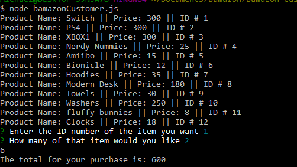
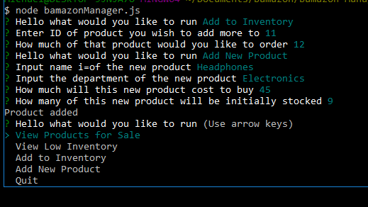

# Bamazon

# Bamazon is a simple node server side app that incorporates mysql

# The app is a digital store where customers can 'buy' products and a manager can monitor and adjust inventory.

# This image shows the perspective of the customer interaction. The app begins by printing out all products currently in the store with their price and item Id, all pulled from mysql. It proceeds to ask customers what they would like to buy and how many via the inquisitor npm. With a conditional statement, if there is enough stock in the store it will process the purchase and print out the total cost and altering the stock in mysql, otherwise it will return saying not enough stock.

# This image demonstrates the perspective of the manger side. The app begins with an inquisitor prompt for which action the manager would like to take.

  # 'View Products for sale' and 'View Low Inventory' simply print out all products in the mysql database like in the customer demo. The manager side also gets a stock quantity output and the low inventory option only displays products with less than 5 items in stock.
  # 'Add inventory' Allows the manager to add stock to an item in the store. Similar to the process used in the customer purchase situation, the manger is asked to provide item Id and how much to restock and the mysql is updated accordingly.
  # 'Add a new product' Allows the manger to add an item to the store. The app will give the manager a series of prompts to establish product variable values before adding it into the mysql database.
  
  
  
  # Future plans for functions to add is an 'update product info' and 'delete product' to the manager perspective, a 'buy more' option for customers, and a supervisor perspective. These will happen when I have time to get to them 
